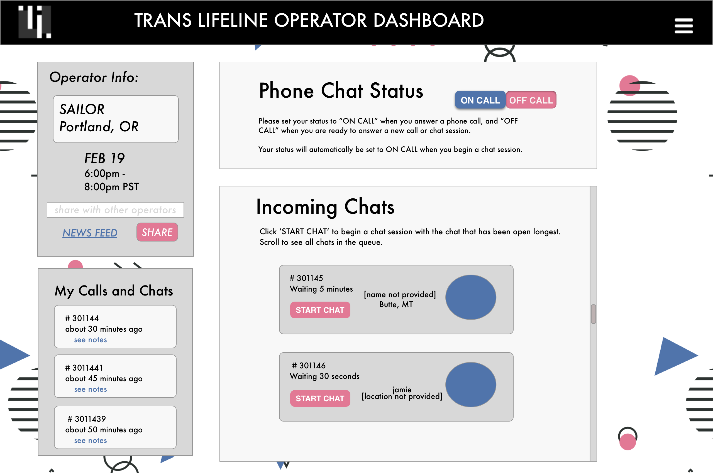
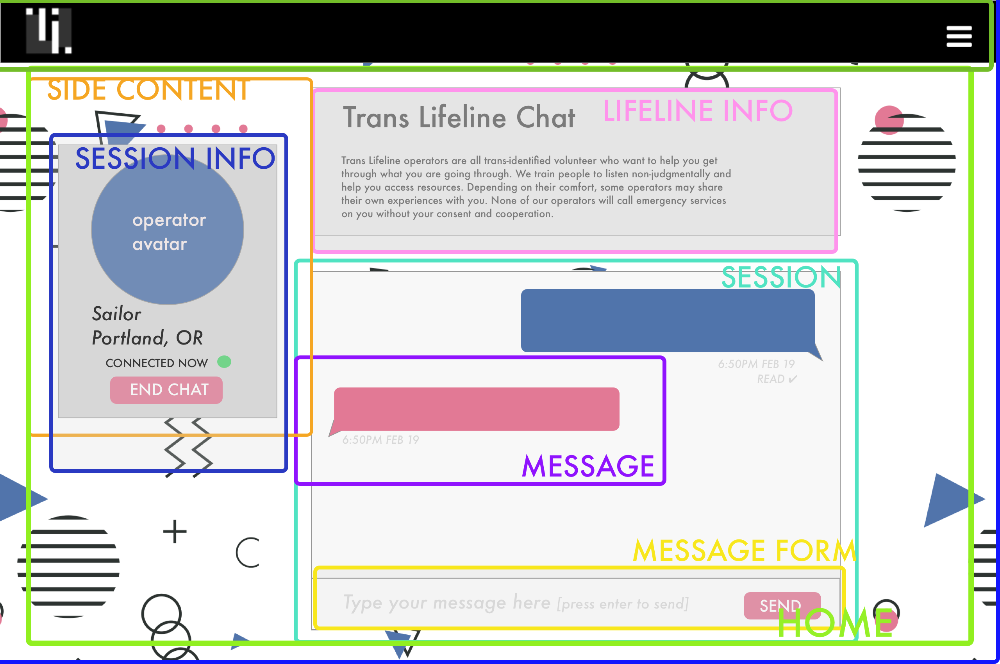

# **Trans Lifeline Web Chat** ☎️

## Project Description
Trans Lifeline is a non-profit hotline for transgender people experiencing crisis. It is staffed by transgender volunteer operators. Their mission is to end transgender suicide and improve overall mental health of transgender people through education, advocacy, and direct service.

The purpose of this application is to create a live chat mode of talking with a Trans Lifeline volunteer operator, an alternative to a voice phone call. The application expresses a user story for a person seeking crisis support using chat, and a user story for a volunteer operator connecting to people in the queue, chatting, and creating case notes.

### MVP:
**Session:**
* Messages for a single chat session are rendered in chat window
* Messages are time-stamped and attached to operator or chatter
* Operator and chatter’s messages are distinguishable from eachother and appear in chronological order

**Operator:**
* Can see sessions to start with time requested
* Can initiate session with chatter
* Can type message and send, and see message in window
* Can see messages sent to window by chatter
* Can compose notes for chat session
* Can end session
* Has state of : isConnected or !isConnected

**Chatter:**
* Can see chat how to before starting
* Can place a chat for operator to answer
* Can see when they are connected with an operator
* Can end session
* Caller can see when they are connected with an operator
* Can type message and send, and see message in window
* Chatter can tell that the operator is listening

## Static Mock Up:
Note: You could also open the attached sketch file "assets/sketch files/MVP mock.sketch" and view both pages if your computer has Sketch App installed.





## Static Mock Up with Components Labeled:
Note: Lines around APP and Header were cut off when I exported from Sketch





### Built Using:

* React
* Javascript
* (possibly) Bootstrap or Materialize depending on design needs
* Redux
* Jest (testing)
* Firebase
* Moment.js
* A chat engine? Firechat or Pubnub
* Deploy using Heroku


## Installation Instructions
in the terminal:
```
npm install webpack@3.4.0 webpack-dev-server@2.5.0 eslint eslint-plugin-react -g

clone this repository
npm init
npm install
```
### Future Enhancements:
* Chatter can be in a chat queue and know their place in queue
* Chatter can add a chat avatar
* Operator can add a chat avatar
* Chatter and Operator can switch to a phone call.
* Chatter can see helpful information while waiting to chat
* Chatter and operator can see when the other person is typing
* Operator can record call notes by session ID
* Operator can access a quick resource menu with information from operator training
* Application can support multiple simultaneous sessions between operators and chatters
* Caller can send and receive messages with an operator via SMS

Future Enhancements Required Tools:
* Twilio API to receive and send SMS

## Author
**Sailor Winkelman** - [GitHub](https://github.com/sailor27) | [LinkedIn](https://www.linkedin.com/in/sailor-winkelman-62429152)

## Component Tree Visual


## Issues/Bugs 🐛
**I am struggling with understanding how to build my component tree.**


## Guide:
[hooking up redux to firebase](https://itnext.io/hooking-up-firebase-to-your-redux-store-a5e799cf84c4)
[intro to middleware](https://www.learnhowtoprogram.com/react/advanced-topics/introduction-to-middleware)
next steps:
* connect middleware
* install thunk
* persist in local storage
* install firebase
